# Web-Scraping-Challenge: Mission to Mars!

Ever wonder what the conditions on Mars are right now? Well, look no further! I have created a summary website that shows relevant up to date information about the conditions on mars and other general fun facts. I scraped various NASA websites to offer a curated collection of data of the Planet Mars. 

## Table of contents
* [Scrape](#scrape)
* [Mars News](#mars_news)
* [Mars Image](#mars_image)
* [Mars Facts](#mars_facts)
* [Mars Hemispheres](#mars_hemispheres)
* [Scrape Summary](#scrape_summary)
* [Flask](#flask)
* [Index.html](#index.html)
* [Web Site](#web-site)
* [Formatting](#formatting)
* [Resources](#resources)
* [Contact](#contact)

## Scrape

To develop my scraping code, I used `Jupyter Notebook`. This allowed me to test the code in real time to see if the results were what I was looking for. 

First, I imported my dependencies which included:

* Splinter
* BeautifulSoup
* Pandas
* WebDriver_Manager

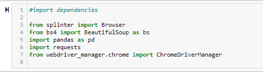

I then connected to my Browser using `executable_path` 

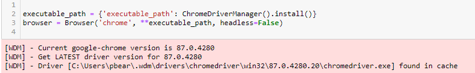

For my final code for scraping in `Visual Studio` I used the same dependencies. 

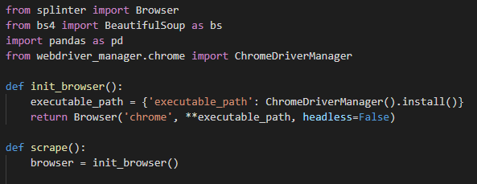

## Mars News

To find my “Mars News”, I used `Beautiful Soup` function `soup.find` . I viewed the web sites code through the “inspect” tool. With this tool, I was able to see that I need to call the `class_="list_text” ` . withing that class, I need to add an additional specification and search for the `class_="content_title” ` . This returned the latest news article headline on the Mars site. I used a similar `soup.find` search to find the correspond text summary of the headline. 

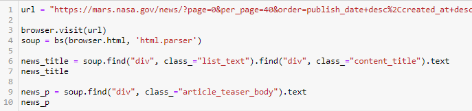

For my final code in `Visual Studio` looked similar:

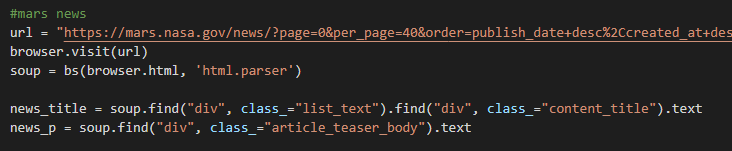

When viewed on the website, the scrape search displays below :

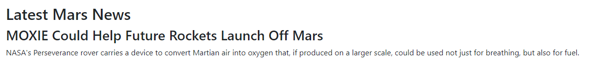

## Mars Image

In order to find the correct format of the main image on the Mars site, I had to add ` .click ` to my searches. I used `browser.find` to locate the part of the site I needed then add the `.click( ) ` to the end of the search. I needed to click two times to find the actual location of the correct size image. Then I returned the `url` of the image as a variable. 

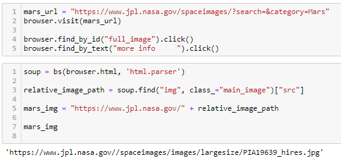

My final code in `Visual Studio` looked similar:

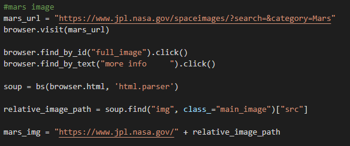

When viewed on the website, the scrape search displays below:

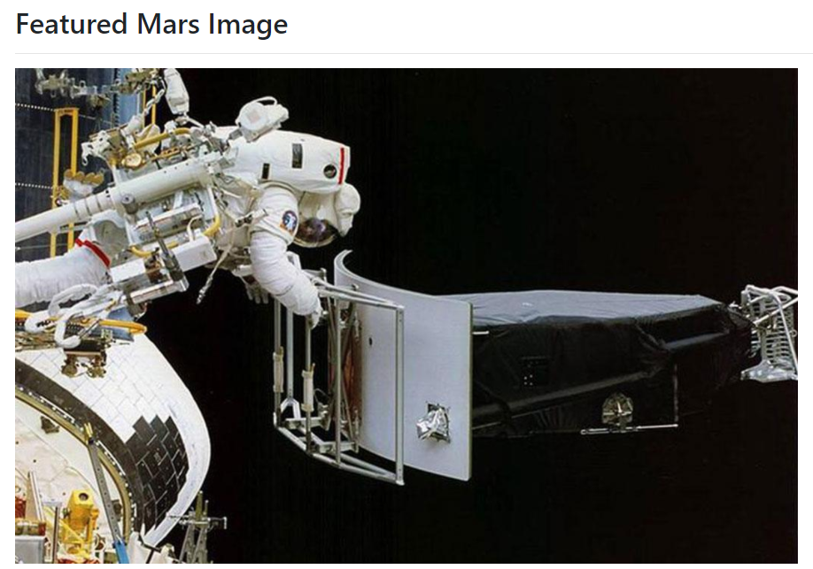

## Mars Facts

To find my Mars Facts table, I simply called the table from the site and converted it into an `hmtl` formate. To do that I used the `pandas` function `to.html( )` . I tried to remove the index from my chart by added `(index=False)` at the end of my formatting, but it did not return the results I was looking for. 

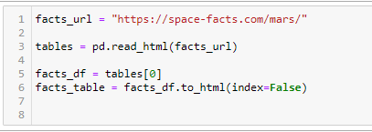

For my final scrape code in `Visusal Studio` , I ended up removing the extra formatting of `index-False)` since it did not help my final table formatting. 

When viewed on the website, the scrape search displays below:

## Mars Hemispheres

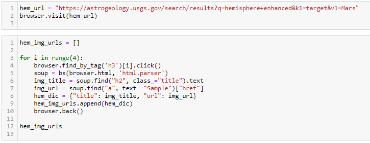

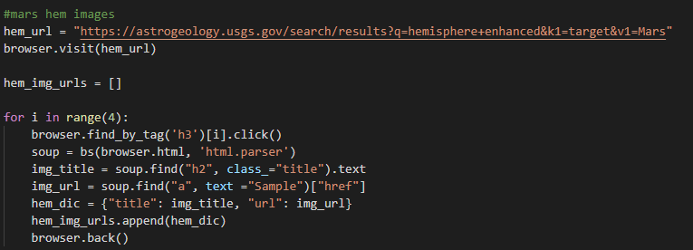

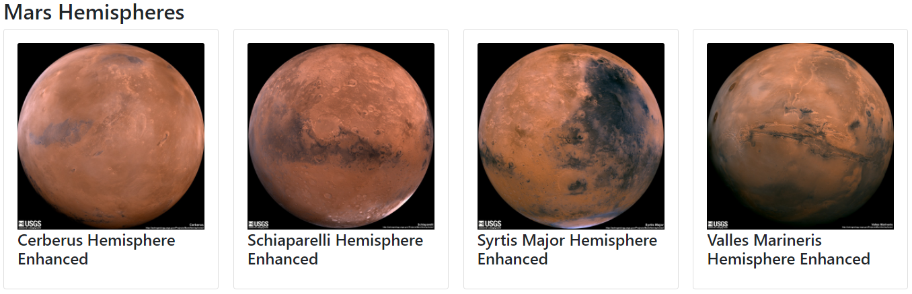

## Scrape Summary

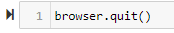

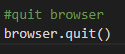

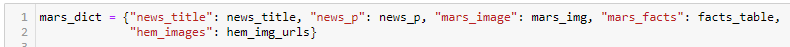

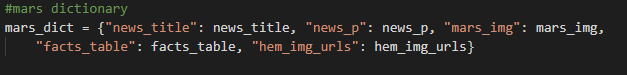

## Flask

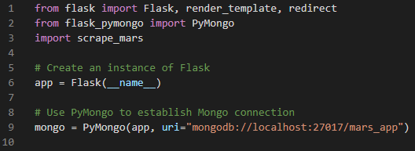

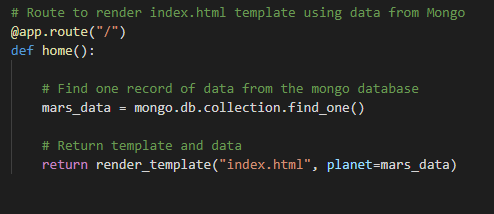

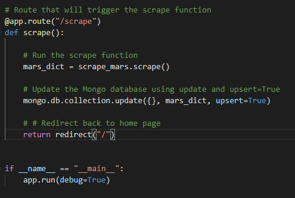

## Index.html

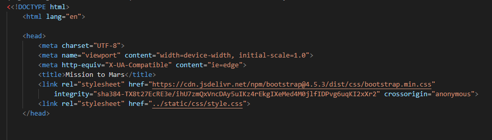

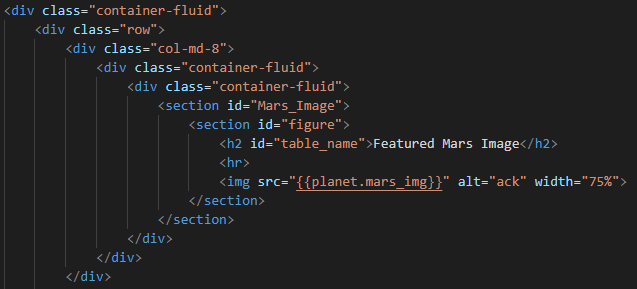

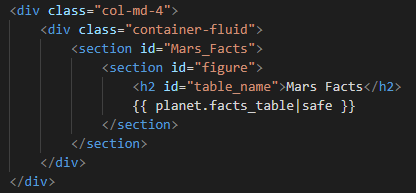

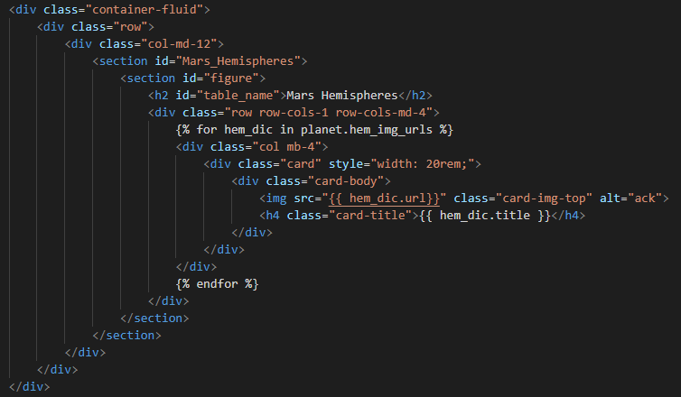

## Web Site

## Formatting

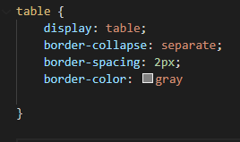

## Resources

NASA LINKS: 

* [NASA News Site](https://mars.nasa.gov/news/?page=0&per_page=40&order=publish_date+desc%2Ccreated_at+desc&search=&category=19%2C165%2C184%2C204&blank_scope=Latest)

* [Mars Image](https://www.jpl.nasa.gov/spaceimages/?search=&category=Mars)

* [Mars Facts](https://space-facts.com/mars/)

* [Mars Hemispheres](https://astrogeology.usgs.gov/search/results?q=hemisphere+enhanced&k1=target&v1=Mars)

## Contact
Sara Simoes
