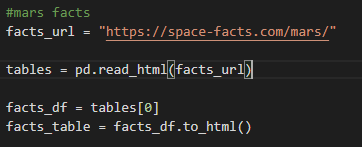
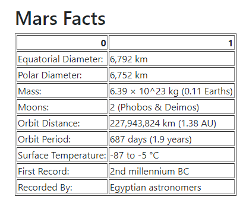

# Web-Scraping-Challenge: Mission to Mars!

Ever wonder what the conditions on Mars are right now? Well, look no further! I have created a summary website that shows relevant up to date information about the conditions on mars and other general fun facts. I scraped various NASA websites to offer a curated collection of data of the Planet Mars. 

## Table of contents
* [Scrape](#scrape)
* [Mars News](#mars_news)
* [Mars Image](#mars_image)
* [Mars Facts](#mars_facts)
* [Mars Hemispheres](#mars_hemispheres)
* [Scrape Summary](#scrape_summary)
* [Flask](#flask)
* [Index.html](#index.html)
* [Formatting](#formatting)
* [Resources](#resources)
* [Contact](#contact)

## Scrape

To develop my scraping code, I used `Jupyter Notebook`. This allowed me to test the code in real time to see if the results were what I was looking for. 

First, I imported my dependencies which included:

* Splinter
* BeautifulSoup
* Pandas
* WebDriver_Manager

I then connected to my Browser using `executable_path` 

For my final code for scraping in `Visual Studio` I used the same dependencies. 

## Mars News

To find my “Mars News”, I used `Beautiful Soup` function `soup.find` . I viewed the web sites code through the “inspect” tool. With this tool, I was able to see that I need to call the `class_="list_text” ` . withing that class, I need to add an additional specification and search for the `class_="content_title” ` . This returned the latest news article headline on the Mars site. I used a similar `soup.find` search to find the correspond text summary of the headline. 

For my final code in `Visual Studio` looked similar:

When viewed on the website, the scrape search displays below :

## Mars Image

In order to find the correct format of the main image on the Mars site, I had to add ` .click ` to my searches. I used `browser.find` to locate the part of the site I needed then add the `.click( ) ` to the end of the search. I needed to click two times to find the actual location of the correct size image. Then I returned the `url` of the image as a variable. 

My final code in `Visual Studio` looked similar:

When viewed on the website, the scrape search displays below:

## Mars Facts

To find my Mars Facts table, I simply called the table from the site and converted it into an `hmtl` formate. To do that I used the `pandas` function `to.html( )` . I tried to remove the index from my chart by added `(index=False)` at the end of my formatting, but it did not return the results I was looking for. 

For my final scrape code in `Visusal Studio` , I ended up removing the extra formatting of `index-False)` since it did not help my final table formatting. 

When viewed on the website, the scrape search displays below:

## Mars Hemispheres

To find images of the hemispheres of Mars, I needed to add a lot of `.click ` to my code. Once I was able to scrape one Image name and image url, I then added the code to a `for loop` . This way I only needed to code the process one time, and then the `for loop` would run through it for each image. 

I created a `list` which contains `dictionaries` of the image name and url to the image. 

The final code in the `Visual Studio` scrape looked the same. 

To view this nicely on the website, I created the images and titles as `cards` using `bootstrap` formatting. 

## Scrape Summary

At the end of all of my scrape queries, I used `browser.quit` to stop running my Chrome browser I started in the initial set up. 

To organize my data in a way to easily call to my `flask` , I added all of my results to a master dictionary. 

## Flask

To preform my data scaping in Flask I needed to use a `app.py` file and import the below dependencies. I also imported my `scrape_mars.py ` file.  

Then I created a home route that would link to my `mongo_db` 

I defined my scrape function as below and returned my called on my final mars dictionary I had created in my `mars_scrape.py` 

## Index.html

To create my website to display my Mars Scrape, I used the below standard code and linked to `bootstrap` and my formatting `style.css ` file. This is all included in the `<head>` . 

At the top of the website page, there is a large button that initiates my `scrape_mars.py` .

To make the final scrape results return in an organized format, I created each scrape return in a container and aligned the containers using the `grid` method. To reference the Mars News, I note the variables `news_title` and `news_p` on the website. To reference them, they need to be inside double curly brackets `{{ }}` . 

To reference the mars image, I note the mars variable `mars_image` which is a url. To display an image from a url, you need to use the code 

``

I added further formatting by sizing the image at `width=75%` . When previewing the image, it displayed nicely at this size on a full size monitor. 

The table is already formatted in `.hmtl` to view as a table so all I needed to do was reference the variable in `{{ }}` . The formatting was coming up with an error so I had to add ` |safe ` after the variable to display correctly. 

The most complex display was the Mars Hemisphere images. I displayed them as `cards` which is a formatting from `bootstrap` . To do this, I had to call the images in my list/dictionary with a `for loop` in my `index.html` document in order to print each dictionary item inside a card. To do this, I referenced the dictionary and the part of the dictionary I needed. For example, for the title, I referenced `hem_dict.title` and for the url I referenced `hem_dict.url` - which also needed to be printed as an image. 

I then referenced `bootstrap` documentation to display my 4 cards evenly in a grid but the code did not work on the final display. They are neatly in the container; but displayed in 1 row and not in a 4-grid. 

## Formatting

I had trouble formatting my table, so I added a `style.css` to help. I was able to add a nice grid and hide the index on the left side. It is not as clean as I would have liked, but it still came out quite clear. 

## Resources

NASA LINKS: 

* [NASA News Site](https://mars.nasa.gov/news/?page=0&per_page=40&order=publish_date+desc%2Ccreated_at+desc&search=&category=19%2C165%2C184%2C204&blank_scope=Latest)

* [Mars Image](https://www.jpl.nasa.gov/spaceimages/?search=&category=Mars)

* [Mars Facts](https://space-facts.com/mars/)

* [Mars Hemispheres](https://astrogeology.usgs.gov/search/results?q=hemisphere+enhanced&k1=target&v1=Mars)

## Contact
Sara Simoes
