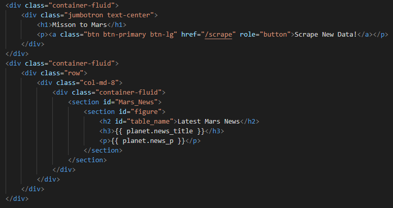
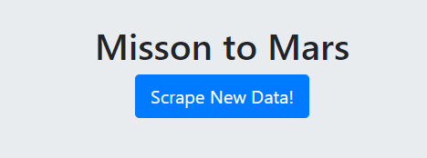

# Web-Scraping-Challenge: Mission to Mars!

Ever wonder what the conditions on Mars are right now? Well, look no further! I have created a summary website that shows relevant up to date information about the conditions on mars and other general fun facts. I scraped various NASA websites to offer a curated collection of data of the Planet Mars. 

## Table of contents
* [Scrape](#scrape)
* [Mars News](#mars_news)
* [Mars Image](#mars_image)
* [Mars Facts](#mars_facts)
* [Mars Hemispheres](#mars_hemispheres)
* [Scrape Summary](#scrape_summary)
* [Flask](#flask)
* [Index.html](#index.html)
* [Web Site](#web-site)
* [Formatting](#formatting)
* [Resources](#resources)
* [Contact](#contact)

## Scrape

## Mars News

## Mars Hemispheres

##Scrape Summary

## Flask

## Index.html

## Web Site

## Formatting

## Resources

NASA LINKS: 

[NASA News Site](https://mars.nasa.gov/news/?page=0&per_page=40&order=publish_date+desc%2Ccreated_at+desc&search=&category=19%2C165%2C184%2C204&blank_scope=Latest)

[Mars Image](https://www.jpl.nasa.gov/spaceimages/?search=&category=Mars)

[Mars Facts](https://space-facts.com/mars/)

[Mars Hemispheres](https://astrogeology.usgs.gov/search/results?q=hemisphere+enhanced&k1=target&v1=Mars)

## Contact
Sara Simoes
